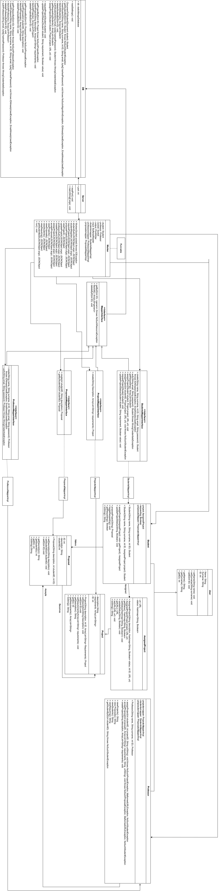
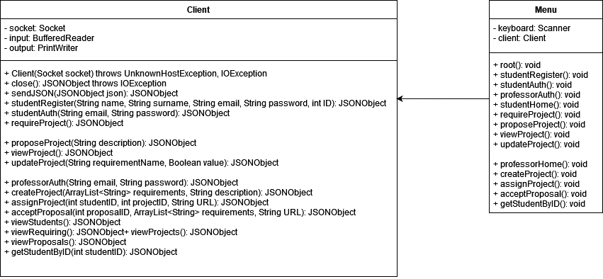

# Introduction

Students can sign up on the platform, ask for a project or propose one, and update its progress status.

Professors can assign a project or accept a proposal defining its requirements.

From the description above we specify the following:
- Email and ID field are unique. A student and a professor may have the same ID, since they're implemented as distinct entities.
- Every student may have only an active proposal at once
- Project's progress status means specifying for every requirement if it is satisfied.

The following field is added:
- URL for every assigned project
    
# Operations
## Student
- Making or canceling a project request.
- Proposing a project giving a description
    - Every student can have only an active proposal
- View their project if it's been assigned
- Updating their project's progress status
    - Requirement's name and its new value (done/undone) must be given

## Professore
- View all existing projects
- View all existing proposals
- View list of students requiring a project
- Crate a new project
    - Description and requirements list must be given
- Accepting a student's proposal
    - Project is assigned to the student who made the proposal
    - Requirements list and URL must be given
- Assigning a project to a student
    - Project ID and Student ID must be given.
- Getting a Student's info from their ID

# Architecture
This project is based on a Client-Server architecture. Client and server communicate with JSON messages.

Data is stored on a MongoDB database, chosen because data is semistructured.


# Dependencies
Maven is used to import external libraries.
The following dependecies are included in pom.xml file:
- https://mvnrepository.com/artifact/org.mongodb/mongo-java-driver 
- https://mvnrepository.com/artifact/org.json/json

# Server
At boot time the server reads the port number to listen to from its settings file. It then calls the static method readSettings() of DB Class, inizializing the static variable db representing the database connection.




## User
Absract class for Student and Profesor, containing basic attributes and their getter and setter methods.
### Attributes
- private String Name
- private String Surname
- private int ID
### Methods
- public void setName(String name)
- public void setSurname(String surname)
- public void setID(int ID)
- public String getName()
- public String getSurname()
- public int getID()


## Student
Extends User class
### Attributes
- private AssignedProject project
- private Boolean requesting
- private ProposalsMapperImpl proposalsmapper
### Methods
- public Student Student(String name, String surname, int ID)   
- public Student Student(String name, String surname, int ID, AssignedProject project)
- public void assignProject(AssignedProject)
- public AssignedProject getProject()
- public getProjectCompletitionPercentual()
- public void updateProjectStatus(String, Boolean)
- public Proposal proposeProject(String)
- public void toggleRequesting()
- public Boolean getRequesting()
- public String toString()


## Professor
### Attributes
- private ProjectsMapperImpl projectsmapper 
- private StudentsMapperImpl studentsmapper
- private ProposalsMapperImpl proposalsmapper
### Methods
- public Professor Professor(String name, String surname, int ID)
- public void assignProject(int studentID, int projectID, String urlString) throws NoSuchProjectException, MalformedURLException, NoSuchStudentException
- public void acceptProposal(int proposaID, ArrayList <String> requirements, String  urlString) throws NoSuchProposalException, MalformedURLException, NoSuchStudentException
- public void createProject(String description, ArrayList 
<String> requirements)
- public String viewProjects()
- public String viewProposals()
- public String viewStudents()
- public String viewRequiring()
- public String getStudentByID(int studentID) throws NoSuchStudentException


## Project
### Attributes
- private String description
- private ArrayList <String> requirements
- private int ID
### Methods
- public Project Project(String description, int ID, ArrayList <String> Requirements)
- public void setDescription(String Description)
- public void setID(int ID)
- public void setRequirements(ArrayList <String> requirements)
- public String getDescription()
- public int getID()
- public ArrayList <String> getRequirements()
- public String toString()

## AssignedProject
### Attributes
- private URL url
- private Hashmap <String, Boolean> status
### Methods
- public AssignedProject(String description, Hashmap <String, Boolean> status, int ID, URL url)
- public AssignedProject(Project project, URL url)
- public Hashmap <String, Boolean> getStatus()
- public void setStatus(Hashmap <String, Boolean>)
- public void updateStatus(String, Boolean)
- public URL getURL()
- public void setURL(URL url)
- public String toString()


## Proposal
### Attributes
- private int ID
- private String description
- private int studentID
### Methods
- public Proposal(String description, int studentID, int ID)
- public void setDescription(String description)
- public void setStudentID(int studentID)
- public void setID(int ID)
- public String getDescription()
- public int getStudentID()
- public int getID()
- public String toString()


## Server
### Attributes
- private int port
### Methods
- public static void readPort()
- public static void main(String[] args)
        

## Worker
Class implementing Runnable interface. An instance is created for every server connection.
### Attributes
- private Student student
- private Professor professor
- private Socket socket
- private PrintWriter output
- private BufferedReader input
- private StudentsMapperImpl studentsmapper
- private ProfessorsMapperImpl professorsmapper
- private ProposalsMapperImpl proposalsmapper
### Methods
- public Worker(Socket socket) throws IOException
- public JSONObject studentAuth(JSONObject args)
- public JSONObject studentRegister(JSONObject args)
- public JSONObject requireProject(JSONObject args)
- public JSONObject proposeProject(JSONObject args)
- public JSONObject viewProject()
- public JSONObject updateProject(JSONObject args)
- public JSONObject professorAuth(JSONObject args)
- public JSONObject createProject(JSONObject args)
- public JSONObject assignProject(JSONObject args)
- public JSONObject acceptProposal(JSONObject args)
- public JSONObject viewProjects()
- public JSONObject viewProposals()
- public JSONObject viewStudents()
- public JSONObject viewRequiring()
- public JSONObject getStudentByID(JSONObject args)
- public void run()
        
## DB
Class used for connecting to the database
### Attributes
- static MongoDatabase db
    - Represents the connection to the database
### Methods
- static void readSettings()
    - sets db attribure reading IP and port from db.conf file.
- private Student DocumentToStudent(Document student)
- public Student getStudentByID(int ID) throws NoSuchStudentException
- public void insertStudent(String name, String surname, int ID, String email, byte[] hashedPassword) throws NoSuchAlgorithmException, IDAlreadyUsedException, EmailAlreadyUsedException
- public  ArrayList <Student> fetchAllStudents()
- public void deleteStudentByID(int ID)
- public Student authStudent(String email, byte[] hashedPassword) throws WrongCredentialsException
- public ArrayList <Student> getRequestingStudents()
- public void assignProject(Student student, Project project, URL url)

- public void requestProject(Student student)
- public void updateProjectStatus(Student student, String requirement, Boolean value)

- public Project getProjectByID(int ID) throws NoSuchProjectException
- public void insertProject(String description, ArrayList <String> requirements)
- public ArrayList <Project> fetchAllProjects()
- public void deleteProjectByID(int ID)

- public Proposal getProposalByID(int ID) throws NoSuchProposalException
- public void insertProposal(int studentID, String description)
- public ArrayList <Proposal> fetchAllProposals()
- public void deleteProposalByID(int ID)

- public Professor getProfessorByID(int ID) throws NoSuchProfessorException
- public void insertProfessor(String name, String surname, int ID, String email, byte[] hashedPassword) throws IDAlreadyUsedException, EmailAlreadyUsedException
- public ArrayList <Professor> fetchAllProfessors()
- public void deleteProfessorByID(int ID)
- public Professor authProfessor(String email, byte[] hashedPassword) throws WrongCredentialsException


## MapperInterface
Interface implemented by all Mapper classes.
### Methods
- public  <generic> getByID(int ID) throws NoSuchResourceException
- public ArrayList <generic> fetchAll()
- public void deleteByID(int ID)
    

## StudentsMapperInterface
### Methods
- public Student create(String name, String surname, int ID, String email, String password) throws IDAlreadyUsedException, EmailAreadyUsedException
- public Student auth(String email, String password) throws WrongCredentialsException
- public ArrayList <Student> getRequesting()
- public void assignProject(Student student, Project project, URL url)
- public void assignProject(int studentID, Project project, URL url) throws NoSuchStudentException
- public void requestProject(Student student)
- public void updateProjectStatus(Student student, String requirement, Boolean value)
## StudentsMapperImpl

## ProjectsMapperInterface
### Methods
- public Project create(String Description, ArrayList <String> requirements)
## ProjectsMapperImpl

## ProposalsMapperInterface
### Methods
- public Proposal create(int studentID, String description)
- public Proposal getByStudentID(int studentID)        
## ProposalsMapperImpl

## ProfessorsMapperInterface
### Methods
- public Professor create(String name, String surname, int ID, String email, String password) throws IDAlreadyUsedException, EmailAreadyUsedException
- public Professor auth(String email, String password)throws WrongCredentialsException        
## ProfessorMapperImpl
## Eccezioni
Sono stato definite delle eccezioni per gestire alcune situazioni.
### NoSuchResourceException
Eccezione che indica l'assenza di una risorsa dal database. Viene ulteriormente estesa in:
- NoSuchProfessorException
        - NoSuchStudentException
        - NoSuchProjectException
        - NoSuchProposalException 
### EmailAlreadyUsedException
### IDAlreadyUsedException
### WrongCredentialsException

# Client



## Client
Handles communication with server
### Attributes
- private Socket socket
- private BufferedReader input
- private PrintWriter output
### Methods
- public Client(Socket socket) throws UnknownHostException, IOException
- public JSONObject close() throws IOException
- public JSONObject sendJSON(JSONObject json)
- public JSONObject studentRegister(String name, String surname, String email, String password, int ID)
- public JSONObject studentAuth(String email, String password)
- public JSONObject requireProject()

- public JSONObject proposeProject(String description)
- public JSONObject viewProject()
- public JSONObject updateProject(String requirementName, Boolean value)

- public JSONObject professorAuth(String email, String password)
- public JSONObject createProject(ArrayList <String> requirements, String description)
- public JSONObject assignProject(int studentID, int projectID, String URL)
- public JSONObject acceptProposal(int proposalID, ArrayList <String> requirements, String URL)
- public JSONObject viewStudents()
- public JSONObject viewRequiring()
- public JSONObject viewProjects()
- public JSONObject viewProposals()
- public JSONObject getStudentByID(int studentID)
        

## Menu
Implementation of CLI used by the user. Uses Client class to communicate with server.
### Attributes
- private Scanner keyboard
- private Client client
### Methods
- public void root()
- public void studentRegister()
- public void studentAuth()
- public void professorAuth()
- public void studentHome()
- public void requireProject()
- public void proposeProject()
- public void viewProject()
- public void updateProject()

- public void professorHome()
- public void createProject()
- public void assignProject()
- public void acceptProposal()
- public void getStudentByID()
        
# Requisiti
## Information Hiding
Information hiding means hiding how a class or method is implemented. 

This allows a class to use another class without knowing how it works. This gives developers the chance to change the a class implementation without changing the classes that call it.

An example is in create method from class  **StudentsMapperImpl**

```
byte[] hashedPassword;
MessageDigest md = MessageDigest.getInstance("SHA-256");
hashedPassword = md.digest(password.getBytes());
DB.insertStudent(name, surname, ID, email, hashedPassword);
return new Student(name, surname, ID);
```

**InsertStudent** method from **DB** class is called. If its implementation in DB class was to change, for example to use another DBMS, it wouldn't be necessay to change  **StudentsMapperImpl** class.

## Encapsulation

Encapsulation means having attributes in class, together with the methods that operate on them. Using this it is possible to access a class' attributes using its methods from another class. This could be used for example to perform some kind of input validation before assigning a value to an attribute.

**Student** class is an example, although it doesn't perform input validation:

```
public class Student extends Person{
    private AssignedProject project;
    ...
    public void assignProject(Project project, URL url){
        this.project = new AssignedProject(project, url);
    }
    public AssignedProject getProject(){
        return this.project;
    }
}
```

Here project attribute is private, meaning it is exclusively accessible using those two methods.

## Inheritance

Inheritance involves a parent class and a child class, where the child class inherits methods and attributes from their parent, utilizing them eventually modifying them (Override).
This is accomplished in Java using **Extends** keyword. We have this between **Person** and **Student** classes:

```
public abstract class Person { ... }
public class Student extends Person{ ... }
```

This way **Student** class inherits all methods and attributes from **Person** class, and can use all its methods, including the Constructor:

```
  public Student(String name, String surname, int ID){
        super(name, surname, ID);
        this.requesting = false;
    }
```

Student class calls its parent Constructor with parameters **(String, String, ID)** adding a new attribute.
A class can have only one parent.

## Overloading
**Overloading** allows a class to have several methods with the same name, giving them different implementation, but only if the signatures are different.

This is used in **StudentsMapperInterface** class:

```
public void assignProject(Student student, Project project, URL url);
public void assignProject(int studentID, Project project, URL url) throws NoSuchStudentException;
```

In this case the second methods gets a student from the database and then calls the first method.
In **StudentsMapperImpl** class:

```
@Override
    public void assignProject(Student student, Project project, URL url) {
        DB.assignProject(student, project, url);
    }

@Override
    public void assignProject(int studentID, Project project, URL url) throws NoSuchStudentException {
        DB.assignProject(getByID(studentID), project, url);
    }
```

## Overriding
Override means means modifying a method inherited from a parent class or an implemented interface (mandatory in this latter case).

In **Student** class, the method toString is overridden, which is first defined in **Object** class, every class' father.

```
@Override
public String toString{
    return (getID() + " " + getName() + " " + getSurname());
    }}
```

## Classe Astratta
An abstract class is a class having abstract or implemented methods, but no object can be an instance of this class. Abstract methods must be implemented in a child class unless it's an abstract class itself.

An abstract class is **Person**, which in this case has no abstract methods:

```
public abstract class Person{
    ...
}
```

## Interfaccia
Interfaces are collections of attributes and abstract methods, it can't have implementend methods, unlike abstract classes.

A class can implement several interfaces at once and extend a class at the same time. This allows to achieve something similiar to multiple inheritance.

An example is **ProposalsMapperInterface**:

```
public interface ProposalsMapperInterface extends MapperInterface <Proposal> {
    public Proposal create(int studentID, String description);
    public Proposal getByStudentID(int studentID);
}
```

This interface inherits **MapperInterface** methods, without the need to override them since its an interface itself.

## Networking
Java provides four classes for network connections, both UDP and TCP.

UDP mode implemented DatagramSocket and DatagramPacket.

TCP mode, used in this project, is implemented with Socket and ServerSocket.

ServerSocket class is used in the Server that listens to a port, generating a Socket object when it receives a connection.

Socket class is used to exchange data in both ways of communication.

**Server** class:

```
...
ServerSocket serversocket = new ServerSocket(Server.port);
...
while(true){
    System.out.println("Listening for connection");
    Socket socket = serversocket.accept();
    System.out.println("Connection accepted");
    Thread worker = new Thread(new Worker(socket));
    worker.start();
}
```

First serversocket is created, binded to Server.port.

In an infinite while loop is called the method **accept**, waiting for connection and creating a Socket object when one is received.
This Socket object is then used to create a Worker class that communicates with the client.


## Multithreading
Multithreading allows to execute several instruction threads concurrently, sharing some resources without the need to create a new process.

Java provides two ways to implement multithreading:
- extending **Thread** class and then calling the method **start**
- implementing **Runnable** interface and overriding **run** method, which will be called when the thread starts. A Thread object is then created, giving an object implementing the Runnable interface to the constructor. The method start is then called.

Multithreading is used to handle more client-server connections concurrently. **Worker** class implements the methods to interact with the client.

```
    public class Worker implements Runnable{
    ...
    
    public void run(){
    ...
    }
    }

Thread worker = new Thread(new Worker(socket));
worker.start();

```

Creation of Thread object and call of method start in class Server'main method.
